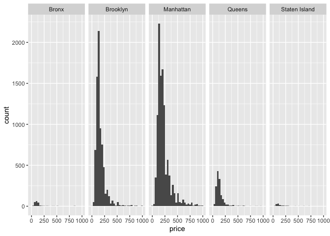

Case Study
================
Juliet Rowe
2023-10-10

## Load packages and data

``` r
library(tidyverse)
```

    ## ── Attaching core tidyverse packages ──────────────────────── tidyverse 2.0.0 ──
    ## ✔ dplyr     1.1.2     ✔ readr     2.1.4
    ## ✔ forcats   1.0.0     ✔ stringr   1.5.0
    ## ✔ ggplot2   3.4.2     ✔ tibble    3.2.1
    ## ✔ lubridate 1.9.2     ✔ tidyr     1.3.0
    ## ✔ purrr     1.0.1     
    ## ── Conflicts ────────────────────────────────────────── tidyverse_conflicts() ──
    ## ✖ dplyr::filter() masks stats::filter()
    ## ✖ dplyr::lag()    masks stats::lag()
    ## ℹ Use the conflicted package (<http://conflicted.r-lib.org/>) to force all conflicts to become errors

``` r
library(dplyr)
library(ggridges)
library(p8105.datasets)

data(nyc_airbnb)

str(nyc_airbnb)
```

    ## spc_tbl_ [40,753 × 17] (S3: spec_tbl_df/tbl_df/tbl/data.frame)
    ##  $ id                            : num [1:40753] 7949480 16042478 1886820 6627449 5557381 ...
    ##  $ review_scores_location        : num [1:40753] 10 NA NA 10 10 10 10 9 10 9 ...
    ##  $ name                          : chr [1:40753] "City Island Sanctuary relaxing BR & Bath w Parking" "WATERFRONT STUDIO APARTMENT" "Quaint City Island Community." "Large 1 BDRM in Great location" ...
    ##  $ host_id                       : num [1:40753] 119445 9117975 9815788 13886510 28811542 ...
    ##  $ host_name                     : chr [1:40753] "Linda & Didier" "Collins" "Steve" "Arlene" ...
    ##  $ neighbourhood_group           : chr [1:40753] "Bronx" "Bronx" "Bronx" "Bronx" ...
    ##  $ neighbourhood                 : chr [1:40753] "City Island" "City Island" "City Island" "City Island" ...
    ##  $ lat                           : num [1:40753] -73.8 -73.8 -73.8 -73.8 -73.8 ...
    ##  $ long                          : num [1:40753] 40.9 40.9 40.8 40.8 40.9 ...
    ##  $ room_type                     : chr [1:40753] "Private room" "Private room" "Entire home/apt" "Entire home/apt" ...
    ##  $ price                         : num [1:40753] 99 200 300 125 69 125 85 39 95 125 ...
    ##  $ minimum_nights                : num [1:40753] 1 7 7 3 3 2 1 2 3 2 ...
    ##  $ number_of_reviews             : num [1:40753] 25 0 0 12 86 41 74 114 5 206 ...
    ##  $ last_review                   : Date[1:40753], format: "2017-04-23" NA ...
    ##  $ reviews_per_month             : num [1:40753] 1.59 NA NA 0.54 3.63 2.48 5.43 2.06 5 2.98 ...
    ##  $ calculated_host_listings_count: num [1:40753] 1 1 1 1 1 1 1 4 3 4 ...
    ##  $ availability_365              : num [1:40753] 170 180 365 335 352 129 306 306 144 106 ...

## Brainstorm questions

- Where are airbnbs most expensive?
- How long are airbnbs active?
  - Are airbnbs illegal and do they get shut down?
- Which units have the most availability?
- How is review score impacted by location?
- How many apts are run by one host?
  - Does that affect price?
  - Does that vary by neighborhood?
- Where are airbnbs?
  - Borough? Neighborhood?
  - Lat and long?

## Do some EDA

``` r
nyc_airbnb |>
  count(neighbourhood_group)
```

    ## # A tibble: 5 × 2
    ##   neighbourhood_group     n
    ##   <chr>               <int>
    ## 1 Bronx                 649
    ## 2 Brooklyn            16810
    ## 3 Manhattan           19212
    ## 4 Queens               3821
    ## 5 Staten Island         261

``` r
nyc_airbnb |>
  group_by(neighbourhood_group, room_type) |>
  summarize(median_price = median(price)) |>
  pivot_wider(
    names_from = room_type,
    values_from = median_price
  )
```

    ## `summarise()` has grouped output by 'neighbourhood_group'. You can override
    ## using the `.groups` argument.

    ## # A tibble: 5 × 4
    ## # Groups:   neighbourhood_group [5]
    ##   neighbourhood_group `Entire home/apt` `Private room` `Shared room`
    ##   <chr>                           <dbl>          <dbl>         <dbl>
    ## 1 Bronx                            100              55            43
    ## 2 Brooklyn                         145              65            40
    ## 3 Manhattan                        190              90            65
    ## 4 Queens                           119              60            39
    ## 5 Staten Island                    112.             55            25

``` r
nyc_airbnb |>
  ggplot(aes(x=price)) +
  geom_histogram() + 
  facet_grid(neighbourhood_group ~ room_type)
```

    ## `stat_bin()` using `bins = 30`. Pick better value with `binwidth`.

<!-- -->

``` r
nyc_airbnb |>
  filter(price >= 9500)
```

    ## # A tibble: 6 × 17
    ##         id review_scores_location name     host_id host_name neighbourhood_group
    ##      <dbl>                  <dbl> <chr>      <dbl> <chr>     <chr>              
    ## 1  3103784                     10 A Priva…  9.83e6 Michael   Brooklyn           
    ## 2  4737930                      8 Spanish…  1.24e6 Olson     Manhattan          
    ## 3   187529                     NA $3200/m…  9.02e5 Georgia   Manhattan          
    ## 4  9528920                      9 Quiet, …  3.91e6 Amy       Manhattan          
    ## 5 16429718                     NA Charmin…  1.36e7 Lena      Brooklyn           
    ## 6 12955683                      8 Great l…  3.57e7 Duan      Manhattan          
    ## # ℹ 11 more variables: neighbourhood <chr>, lat <dbl>, long <dbl>,
    ## #   room_type <chr>, price <dbl>, minimum_nights <dbl>,
    ## #   number_of_reviews <dbl>, last_review <date>, reviews_per_month <dbl>,
    ## #   calculated_host_listings_count <dbl>, availability_365 <dbl>

``` r
nyc_airbnb |>
  filter(price < 1000, room_type == "Entire home/apt") |>
  ggplot(aes(x=price)) +
  geom_histogram() + 
  facet_grid(. ~ neighbourhood_group)
```

    ## `stat_bin()` using `bins = 30`. Pick better value with `binwidth`.

<!-- -->

``` r
nyc_airbnb |>
  filter(price < 1000, room_type == "Entire home/apt", neighbourhood_group == "Manhattan") |>
  group_by(neighbourhood) |>
  summarize(n_apt = n(), mean_price = mean(price)) |>
  arrange(desc(mean_price))
```

    ## # A tibble: 32 × 3
    ##    neighbourhood      n_apt mean_price
    ##    <chr>              <int>      <dbl>
    ##  1 Tribeca              100       358.
    ##  2 NoHo                  61       312.
    ##  3 Flatiron District     75       307.
    ##  4 SoHo                 234       296.
    ##  5 Theater District      93       282.
    ##  6 Midtown              655       276.
    ##  7 Battery Park City     44       271.
    ##  8 Greenwich Village    282       256.
    ##  9 Chelsea              765       255.
    ## 10 Financial District   228       250.
    ## # ℹ 22 more rows

``` r
nyc_airbnb |>
    filter(price < 1000, room_type == "Entire home/apt", neighbourhood_group == "Manhattan") |>
  mutate(neighbourhood = fct_reorder(neighbourhood, price)) |>
  ggplot(aes(x=price, y=neighbourhood)) + geom_density_ridges()
```

    ## Picking joint bandwidth of 26.6

<!-- -->

## Attempt solutions

1)  How is review score impacted by location? By neighborhood, then by
    borough

``` r
nyc_airbnb2 = nyc_airbnb |>
  group_by(neighbourhood) |>
  summarize(average_review_score = mean(review_scores_location, na.rm = TRUE)
  )

nyc_airbnb3 = nyc_airbnb |>
  group_by(neighbourhood_group) |>
  summarize(average_review_score = mean(review_scores_location, na.rm = TRUE)
  )
```
